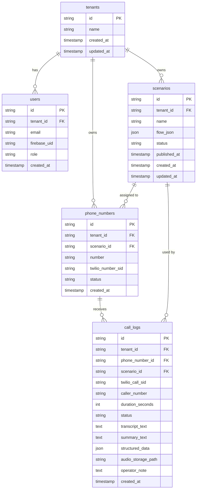

# 04 DBスキーマ定義書

## 1. ER図




## 2. テーブル定義

### tenants（テナント）


| カラム        | 型            | 制約                     | 説明   |
| ---------- | ------------ | ---------------------- | ---- |
| id         | VARCHAR(26)  | PK                     | ULID |
| name       | VARCHAR(255) | NOT NULL               | 会社名  |
| created_at | TIMESTAMPTZ  | NOT NULL DEFAULT NOW() |      |
| updated_at | TIMESTAMPTZ  | NOT NULL DEFAULT NOW() |      |


---

### users（ユーザー）


| カラム          | 型            | 制約                          | 説明                |
| ------------ | ------------ | --------------------------- | ----------------- |
| id           | VARCHAR(26)  | PK                          | ULID              |
| tenant_id    | VARCHAR(26)  | FK → tenants.id             |                   |
| email        | VARCHAR(255) | NOT NULL UNIQUE             |                   |
| firebase_uid | VARCHAR(128) | NOT NULL UNIQUE             | Firebase Auth UID |
| role         | VARCHAR(20)  | NOT NULL DEFAULT 'operator' | admin / operator  |
| created_at   | TIMESTAMPTZ  | NOT NULL DEFAULT NOW()      |                   |


**インデックス:** `firebase_uid`（認証ミドルウェアで頻繁に使用）

---

### phone_numbers（電話番号）


| カラム               | 型           | 制約                          | 説明                 |
| ----------------- | ----------- | --------------------------- | ------------------ |
| id                | VARCHAR(26) | PK                          | ULID               |
| tenant_id         | VARCHAR(26) | FK → tenants.id             |                    |
| scenario_id       | VARCHAR(26) | FK → scenarios.id, NULL可    | 未設定の場合 NULL        |
| number            | VARCHAR(20) | NOT NULL                    | E.164 形式（+8130...） |
| twilio_number_sid | VARCHAR(64) | NOT NULL UNIQUE             | Twilio 内部ID        |
| status            | VARCHAR(20) | NOT NULL DEFAULT 'inactive' | active / inactive  |
| created_at        | TIMESTAMPTZ | NOT NULL DEFAULT NOW()      |                    |


---

### scenarios（シナリオ）


| カラム          | 型            | 制約                       | 説明                |
| ------------ | ------------ | ------------------------ | ----------------- |
| id           | VARCHAR(26)  | PK                       | ULID              |
| tenant_id    | VARCHAR(26)  | FK → tenants.id          |                   |
| name         | VARCHAR(255) | NOT NULL                 | シナリオ名             |
| flow_json    | JSONB        | NOT NULL                 | シナリオフロー定義         |
| status       | VARCHAR(20)  | NOT NULL DEFAULT 'draft' | draft / published |
| published_at | TIMESTAMPTZ  | NULL                     | 最後に公開した日時         |
| created_at   | TIMESTAMPTZ  | NOT NULL DEFAULT NOW()   |                   |
| updated_at   | TIMESTAMPTZ  | NOT NULL DEFAULT NOW()   |                   |


**インデックス:** `(tenant_id, status)`（一覧取得で頻繁に使用）

#### flow_json スキーマ例

```json
{
  "nodes": [
    {
      "id": "node_1",
      "type": "speak",
      "data": { "text": "お電話ありがとうございます。" },
      "position": { "x": 100, "y": 100 }
    },
    {
      "id": "node_2",
      "type": "listen",
      "data": {
        "variableName": "purpose",
        "timeoutSeconds": 7,
        "retryCount": 2,
        "retryText": "もう一度お話しください。"
      },
      "position": { "x": 100, "y": 250 }
    }
  ],
  "edges": [
    { "id": "e1", "source": "node_1", "target": "node_2" }
  ]
}
```

---

### call_logs（通話ログ）


| カラム                | 型           | 制約                     | 説明                                         |
| ------------------ | ----------- | ---------------------- | ------------------------------------------ |
| id                 | VARCHAR(26) | PK                     | ULID                                       |
| tenant_id          | VARCHAR(26) | FK → tenants.id        |                                            |
| phone_number_id    | VARCHAR(26) | FK → phone_numbers.id  |                                            |
| scenario_id        | VARCHAR(26) | FK → scenarios.id      | 通話時点のシナリオID                                |
| twilio_call_sid    | VARCHAR(64) | NOT NULL UNIQUE        | Twilio CallSid                             |
| caller_number      | VARCHAR(20) | NOT NULL               | 発信者番号（E.164）                               |
| duration_seconds   | INTEGER     | NULL                   | 通話時間（秒）                                    |
| status             | VARCHAR(20) | NOT NULL               | complete / transferred / abandoned / error |
| transcript_text    | TEXT        | NULL                   | 通話全体の文字起こし                                 |
| summary_text       | TEXT        | NULL                   | AI生成要約                                     |
| structured_data    | JSONB       | NULL                   | ヒアリング結果の構造化データ                             |
| audio_storage_path | TEXT        | NULL                   | Cloud Storage のパス                          |
| operator_note      | TEXT        | NULL DEFAULT ''        | オペレーターメモ                                   |
| created_at         | TIMESTAMPTZ | NOT NULL DEFAULT NOW() | 通話開始日時                                     |


**インデックス:**

- `(tenant_id, created_at DESC)`（一覧取得）
- `(tenant_id, status)`（ステータスフィルタ）
- `transcript_text` GIN インデックス（全文検索）

## 3. マイグレーション方針

- Prisma Migrate を使用
- `prisma/migrations/` にバージョン管理
- 本番への適用は CI/CD パイプライン経由（手動実行禁止）
- カラム削除・型変更は必ず2ステップで行う（追加→データ移行→削除）

## 4. データ保持ポリシー


| データ        | 保持期間      | 削除方法                      |
| ---------- | --------- | ------------------------- |
| 通話ログ（テキスト） | 90日       | Cloud Scheduler で日次バッチ削除  |
| 録音ファイル     | 90日       | Cloud Storage ライフサイクルポリシー |
| シナリオ       | 無期限       | 手動削除のみ                    |
| ユーザー       | アカウント削除まで | 手動削除                      |


